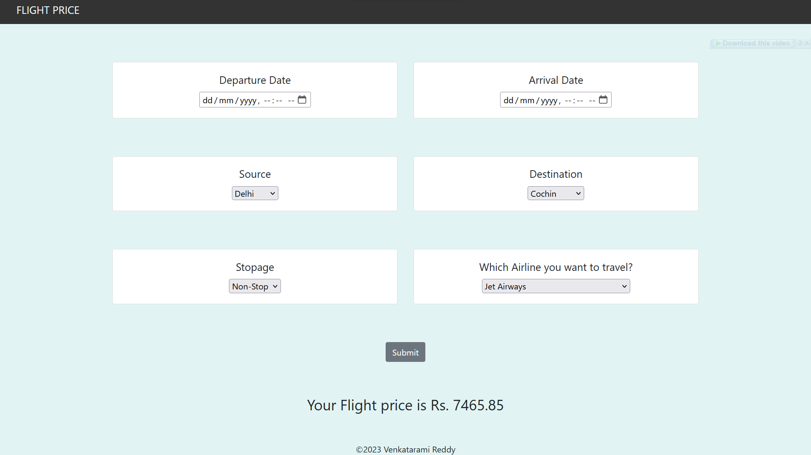

# Flight Fare Prediction: 

## Table of Content
- [Flight Fare Prediction:](#flight-fare-prediction)
  - [Table of Content](#table-of-content)
  - [Demo](#demo)
  - [Overview](#overview)
  - [Motivation](#motivation)
  - [:key: Prerequisites](#key-prerequisites)
  - [:book: Data Preprocessing](#book-data-preprocessing)
  - [🚀  Installation](#-installation)
    - [:bulb: How to Run](#bulb-how-to-run)
  - [Directory Tree](#directory-tree)
  - [Technologies Used](#technologies-used)
  - [Future Scope](#future-scope)
  - [:clap: And it's done!](#clap-and-its-done)
  - [:raising\_hand: Citation](#raising_hand-citation)
  - [:heart: Owner](#heart-owner)
  - [:eyes: License](#eyes-license)


## Demo

[](https://github.com/Chaganti-Reddy/Flight-Fare-Prediction)

## Overview
This is a Flask web app which predicts fare of Flight ticket.

## Motivation
What to do when you are at home due to this pandemic situation? I started to learn Machine Learning model to get most out of it. I came to know mathematics behind all supervised models. Finally it is important to work on application (real world application) to actually make a difference.

## :key: Prerequisites

All the dependencies and required libraries are included in the file <code>requirements.txt</code> [See here](requirements.txt)

## :book: Data Preprocessing

Data pre-processing is an important step for the creation of a machine learning
model. Initially, data may not be clean or in the required format for the model which
can cause misleading outcomes. In pre-processing of data, we transform data into our
required format. It is used to deal with noises, duplicates, and missing values of the
dataset. Data pre-processing has the activities like importing datasets, splitting
datasets, attribute scaling, etc. Preprocessing of data is required for improving the
accuracy of the model.

## 🚀&nbsp; Installation

The Code is written in Python 3.7. If you don&rsquo;t have Python installed you can find it [here](https://www.python.org/downloads/). If you are using a lower version of Python you can upgrade using the pip package, ensuring you have the latest version of pip. To install the required packages and libraries, run this command in the project directory after [cloning](https://www.howtogeek.com/451360/how-to-clone-a-github-repository/) the repository:

1. Clone the repo

```bash
git clone https://github.com/Chaganti-Reddy/Flight-Fare-Prediction.git
```

2. Change your directory to the cloned repo

```bash
cd Flight-Fare-Prediction
```

3. Now, run the following command in your Terminal/Command Prompt to install the libraries required

```bash
python3 -m virtualenv my_env

source my_env/bin/activate

pip3 install -r requirements.txt

```

### :bulb: How to Run

1. Open terminal. Go into the cloned project directory and type the following command:

```bash
python3 app.py
```


## Directory Tree 
```
.
├── Data_Train.xlsx
├── LICENSE
├── README.md
├── Sample_submission.xlsx
├── Test_set.xlsx
├── app.py
├── assets
│   └── main.png
├── flight_price.ipynb
├── flight_rf.pkl
├── requirements.txt
├── static
│   └── css
│       └── styles.css
└── templates
    └── home.html
```

## Technologies Used


[](https://flask.palletsprojects.com/en/1.1.x/) [](https://scikit-learn.org/stable/) 


## Future Scope

* Use multiple Algorithms
* Optimize Flask app.py
* Front-End 

## :clap: And it's done!

Feel free to mail me for any doubts/query
:email: chagantivenkataramireddy1@gmail.com

---

## :raising_hand: Citation

You are allowed to cite any part of the code or our dataset. You can use it in your Research Work or Project. Remember to provide credit to the Maintainer Chaganti Reddy by mentioning a link to this repository and his GitHub Profile.

Follow this format:

- Author's name - Chaganti Reddy
- Date of publication or update in parentheses.
- Title or description of document.
- URL.

## :heart: Owner

Made with :heart:&nbsp; by [Chaganti Reddy](https://github.com/Chaganti-Reddy/)

## :eyes: License

MIT © [Chaganti Reddy](https://github.com/Chaganti-Reddy/Flight-Fare-Prediction/blob/main/LICENSE)
